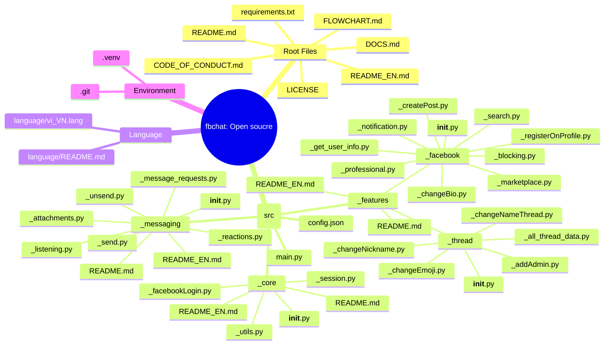

FBChat-Remake: Open Source
=======================================
 
**📢THÔNG BÁO QUAN TRỌNG:** Kể từ 11/2024, Facebook đã chính thức mã hóa tin nhắn đầu cuối giữa người dùng với nhau (*End-to-End Encryption (E2EE)*). Chính vì thế, bây giờ thư viện chỉ lấy được tin nhắn trong nhóm, **không thể** lấy được tin nhắn giữa các người dùng với nhau. Tuy nhiên, ngay tại thời điểm này (24/03/2026) mình đã giải mã được *E2EE* của Messenger, sẽ được cập nhật sớm nhất cho thể.

- - - -

Xin chào, tôi là **MinhHuyDev** / **raintee.dev**. Lời nói đầu, mình xin chân thành cảm ơn những đóng góp vừa qua của các người dùng trong và ngoài nước đã gửi những *ý tưởng* và *vấn đề* đang tồn đọng trong source code này. Trong bản **UPDATE LỚN** này (`v2.x`) đã xử lý hầu hết các lỗi nhỏ lặt vặt và *tái cấu trúc* hoàn toàn: `fbchat-v2`.

Tuy nhiên, vẫn sẽ tồn đọng những lỗi lặt vặt khó tìm thấy, những đoạn code và cấu trúc chưa thật sự đồng bộ với nhau. Nếu bạn tìm thấy những ***vấn đề*** tồn đọng đó, bạn có thể gửi báo cáo tại [report issue](https://github.com/MinhHuyDev/fbchat-v2/issues) hoặc nhắn tin trực tiếp cho tôi qua: [Telegram](https://t.me/MinhHuyDev).


---

> *Đây không phải là API chính thức;* Facebook có sẵn API dành cho chatbot [tại đây](https://developers.facebook.com/docs/messenger-platform/). Thư viện này khác ở chỗ nó sử dụng tài khoản/cookie Facebook thông thường để thay thế.

---


---

**👽Bạn không thể hiểu được tiếng Việt?**, bạn có thể đọc **README** (*ENGLISH*): [tại đây](https://github.com/MinhHuyDev/fbchat-v2/blob/main/README_EN.md)


## `fbchat-v2: Open source` - Tổng quan 
Facebook chat (hay *fbchat*) là dự án hoàn toàn đi theo hướng đi khác so với thư viện mà **Facebook** cung cấp. Thay vì chỉ phục vụ chạy trên *fanpage* và chỉ chấp nhận *access_token* thì `fbchat` hỗ trợ:
 - Đăng nhập thông qua tài khoản Facebook cá nhân bằng **username/password** hoặc **cookies** (*)
 - Đọc được tất cả tin nhắn từ người dùng và nhóm chat (thread)
 - Gửi nhiều loại tin nhắn, kèm tệp, nhãn dán, nhắc đến người dùng, v.v.
 - Tìm kiếm tin nhắn và chuỗi hội thoại.
 - Tạo nhóm, thiết lập biểu tượng cảm xúc nhóm, thay đổi biệt danh, tạo cuộc thăm dò ý kiến, v.v.
  - Sử dụng các công cụ từ `_features._facebook` để đăng bài viết, tìm kiếm người dùng, thay đổi tiểu sử, v.v
 - Uptime theo thời gian thực, trả lời tin nhắn người dùng ngay lập tức theo lệnh được chỉ định.
  - `async`/`await` (COMMING)

Tóm lại, `fbchat-v2` (`fbchat: Open source`) thừa hưởng mọi tính năng mà đàn anh của nó có được, và có thêm nhiều tính năng mới nhất ngay lúc bấy giờ.

(*): Mang rủi ro tiềm tàng có thể bị đánh cắp bởi Hacker
 
 ## Sơ đồ tổng quát của dự án

```text
src/
|-- _core/
|   |-- __init__.py
|   |-- _facebookLogin.py
|   |-- _session.py
|   |-- _utils.py
|   |-- README.md
|   `-- README_EN.md
|-- _features/
|   |-- _facebook/
|   |   |-- __init__.py
|   |   |-- _blocking.py
|   |   |-- _changeBio.py
|   |   |-- _createPost.py
|   |   |-- _get_user_info.py
|   |   |-- _marketplace.py
|   |   |-- _notification.py
|   |   |-- _professional.py
|   |   |-- _registerOnProfile.py
|   |   `-- _search.py
|   |-- _thread/
|   |   |-- __init__.py
|   |   |-- _addAdmin.py
|   |   |-- _all_thread_data.py
|   |   |-- _changeEmoji.py
|   |   |-- _changeNameThread.py
|   |   `-- _changeNickname.py
|   |-- README.md
|   `-- README_EN.md
|-- _messaging/
|   |-- __init__.py
|   |-- _attachments.py
|   |-- _listening.py
|   |-- _message_requests.py
|   |-- _reactions.py
|   |-- _send.py
|   |-- _unsend.py
|   |-- README.md
|   `-- README_EN.md
`-- main.py
```

***flowchart của dự án**: [tại đây](https://github.com/MinhHuyDev/fbchat-v2/blob/main/FLOWCHART.md)


Nhìn một cách TỔNG THỂ, chỉ có 3 tầng chính:

- `_core`: tầng nền tảng (session, token, request helpers, utils).
- `_features`: tầng nghiệp vụ tính năng Facebook/thread.        
- `_messaging`: nhận tin nhắn gửi tin nhắn, và xử lý những gì liên quan đến việc nhắn tin

Trong từng tầng đã có hướng dẫn chi tiết cụ thể tại `_*/README.md` của từng *folder*. 

## Hướng dẫn cài đặt

***YÊU CẦU QUAN TRỌNG***: Người dùng cần phải sử dụng *Python* từ phiên bản 3.10.x trở lên để hoạt động ổn định nhất.

Cài đặt môi trường ảo (*có thể bỏ qua*):
```python
python -m venv .venv
```
Sau khi *run* thành công, dùng lệnh sau để vào môi trường ảo:
```bash
.venv\Scripts\activate
```

Để import `_core`, `_features`, `_messaging` từ script chạy ở root project, bạn có thể đặt `PYTHONPATH=src` hoặc import *thủ công*.

Để tải xuống gói này, bạn có thể dùng `Code > DOWNLOAD ZIP` để tải xuống nhanh nhất hoặc thông qua lệnh `git` dưới đây:
```bash
git clone https://github.com/MinhHuyDev/fbchat-v2
```
Tiếp theo đó là bạn có thể chạy thử file `main.py` (ĐÂY LÀ MỘT FILE BOT BASIC), nó chỉ có vài lệnh cơ bản để bạn *trải nghiệm* và dựa vào cấu trúc đó để xây dựng một con bot riêng cho mình. (*)

(*): Hãy thay ***cookies*** của bạn vào file `config.json` tại key: `cookies`

## Vinh danh người đóng góp

Trong ***4 năm*** *phát triển* và *tồn tại*, tôi với tư là chủ dự án xin chân thành ***CẢM ƠN*** những người đã đóng góp những ý tưởng to lớn, những vấn đề nhỏ về cho dự án một cách chân thành nhất. Nếu như không có các bạn, thật sự dự án này đến giờ đã *chết* trên danh nghĩa cá nhân tôi làm, vì thế, dưới đây là danh sách những người đã gửi đóng góp cho tôi:
 - tomdev112 ([Github](https://github.com/tomdev211))
 - syrex1013 ([Github](https://github.com/syrex1013))
 - Kheir Eddine ([Facebook](https://www.facebook.com/61557637127396/))
 - 陶世玉
 - Jihadi John
 - Bắc Trịnh ([Facebook](https://www.facebook.com/1228855777/))
 - Quang Trần ([Facebook](https://www.facebook.com/100005048402622/))
 - Minh Trần Ngọc ([Facebook](https://www.facebook.com/100000277273223/))
 - Victor Knutsenberger
 - Hoàng Lân ([Facebook](https://www.facebook.com/100026754347158/))
 - Kareem Adel Abomandor
 - @lluevy
 - @phuncnheo
 - @minhphatnw
 - @khanh235a
 - @chapesh1
 - @klongg13
 - @seafibrahem
 - @agent1047
 - @stefekdziura
