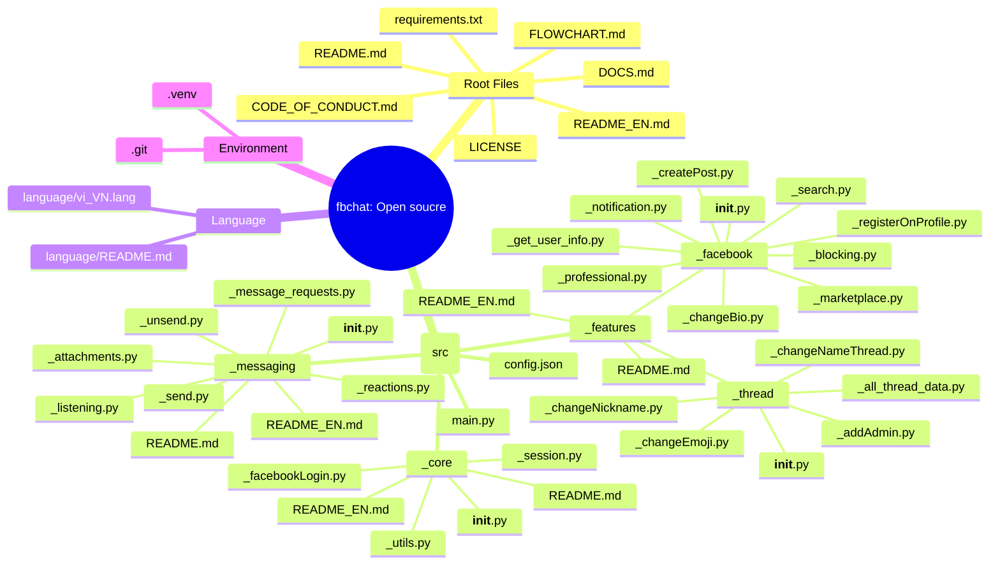

FBChat-Remake: Open Source
=======================================

**📢 IMPORTANT NOTICE:** Since 11/2024, Facebook has officially enabled end-to-end encryption between users (*End-to-End Encryption (E2EE)*). Because of this, the library can currently fetch only group messages and **cannot** fetch direct messages between individual users. However, as of now (24/03/2026), I have successfully decrypted Messenger *E2EE*, and this update will be released as soon as possible.

- - - -

Hello, I am **MinhHuyDev** / **raintee.dev**. First of all, I sincerely thank all users in Vietnam and abroad who contributed ideas and reported unresolved issues in this source code. In this **MAJOR UPDATE** (`v2.x`), most minor bugs were fixed and the project was fully restructured into: `fbchat-v2`.

That said, there may still be some hard-to-detect issues, and parts of the code and structure are not fully consistent yet. If you find any remaining ***issues***, you can submit a report at [report issue](https://github.com/MinhHuyDev/fbchat-v2/issues) or message me directly on [Telegram](https://t.me/MinhHuyDev).


---

> *This is not an official API.* Facebook already provides an official API for chatbots [here](https://developers.facebook.com/docs/messenger-platform/). This library is different because it uses regular Facebook accounts/cookies instead.

---


---

**👽Need the Vietnamese version?** You can read the **README** (*VIETNAMESE*) [here](https://github.com/MinhHuyDev/fbchat-v2/blob/main/README.md)


## `fbchat-v2: Open source` - Overview

Facebook chat (or *fbchat*) follows a completely different direction from the library provided by **Facebook**. Instead of only serving *fanpages* and accepting only *access_token*, `fbchat` supports:
 - Logging in with a personal Facebook account via **username/password** or **cookies** (*)
 - Reading all messages from users and group chats (threads)
 - Sending many types of messages, including files, stickers, user mentions, etc.
 - Searching messages and conversation threads.
 - Creating groups, setting group emojis, changing nicknames, creating polls, etc.
 - Using tools from `_features._facebook` to create posts, search users, update bio, etc.
 - Realtime uptime and instant replies to user messages based on specified commands.
 - `async`/`await` (COMING)

In short, `fbchat-v2` (`fbchat: Open source`) inherits all capabilities of its predecessor and also includes many newer features available at that time.

(*): This carries potential security risks and may be vulnerable to theft by hackers.
 
 ## Project architecture overview

```text
src/
|-- _core/
|   |-- __init__.py
|   |-- _facebookLogin.py
|   |-- _session.py
|   |-- _utils.py
|   |-- README.md
|   `-- README_EN.md
|-- _features/
|   |-- _facebook/
|   |   |-- __init__.py
|   |   |-- _blocking.py
|   |   |-- _changeBio.py
|   |   |-- _createPost.py
|   |   |-- _get_user_info.py
|   |   |-- _marketplace.py
|   |   |-- _notification.py
|   |   |-- _professional.py
|   |   |-- _registerOnProfile.py
|   |   `-- _search.py
|   |-- _thread/
|   |   |-- __init__.py
|   |   |-- _addAdmin.py
|   |   |-- _all_thread_data.py
|   |   |-- _changeEmoji.py
|   |   |-- _changeNameThread.py
|   |   `-- _changeNickname.py
|   |-- README.md
|   `-- README_EN.md
|-- _messaging/
|   |-- __init__.py
|   |-- _attachments.py
|   |-- _listening.py
|   |-- _message_requests.py
|   |-- _reactions.py
|   |-- _send.py
|   |-- _unsend.py
|   |-- README.md
|   `-- README_EN.md
`-- main.py
```

**Project flowchart**: [here](https://github.com/MinhHuyDev/fbchat-v2/blob/main/FLOWCHART.md)


From an overall perspective, there are only 3 main layers:

- `_core`: foundational layer (session, token, request helpers, utils).
- `_features`: business-logic layer for Facebook/thread features.
- `_messaging`: receives and sends messages, and handles everything related to messaging.

Each layer already has detailed instructions in `_*/README.md` inside each folder.

## Installation Guide

***IMPORTANT REQUIREMENT***: Users should use *Python* version 3.10.x or newer for the most stable operation.

Set up a virtual environment (*optional*):
```python
python -m venv .venv
```
After running successfully, use the command below to activate the virtual environment:
```bash
.venv\Scripts\activate
```

To import `_core`, `_features`, and `_messaging` from scripts running at the project root, you can set `PYTHONPATH=src` or import *manually*.

To download this package, you can use `Code > DOWNLOAD ZIP` for the fastest way, or use the `git` command below:
```bash
git clone https://github.com/MinhHuyDev/fbchat-v2
```
After that, you can run `main.py` (**THIS IS A BASIC BOT FILE**). It includes only a few basic commands so you can *try it out* and use that structure to build your own bot.

(*): Replace your ***cookies*** in `config.json` at key: `cookies`

## Contributor Recognition

Over ***4 years*** of *development* and *maintenance*, as the project owner, I sincerely ***THANK*** everyone who contributed major ideas and small issue reports to this project. Without all of you, this project would likely have ended long ago as a one-person effort. Below is the list of people who contributed:
 - tomdev112 ([Github](https://github.com/tomdev211))
 - syrex1013 ([Github](https://github.com/syrex1013))
 - Kheir Eddine ([Facebook](https://www.facebook.com/61557637127396/))
 - 陶世玉
 - Jihadi John
 - Bắc Trịnh ([Facebook](https://www.facebook.com/1228855777/))
 - Quang Trần ([Facebook](https://www.facebook.com/100005048402622/))
 - Minh Trần Ngọc ([Facebook](https://www.facebook.com/100000277273223/))
 - Victor Knutsenberger
 - Hoàng Lân ([Facebook](https://www.facebook.com/100026754347158/))
 - Kareem Adel Abomandor
 - @lluevy
 - @phuncnheo
 - @minhphatnw
 - @khanh235a
 - @chapesh1
 - @klongg13
 - @seafibrahem
 - @agent1047
 - @stefekdziura
