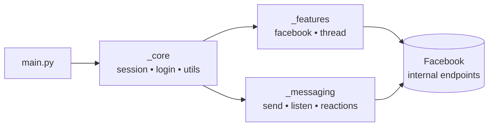
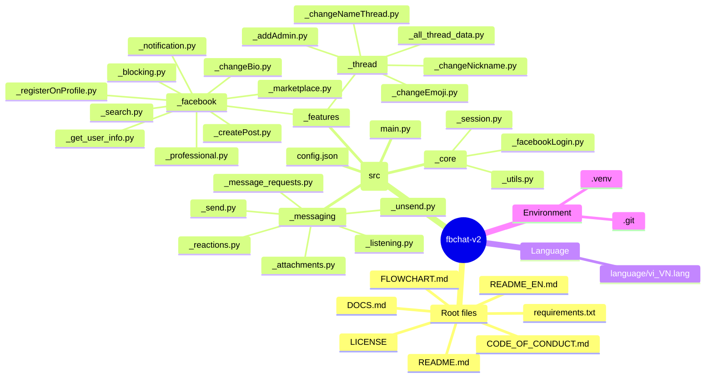

<div align="center">

# FBChat-Remake — Open Source

### A modern, account-based Python library for the unofficial Facebook Messenger API

[](https://github.com/MinhHuyDev/fbchat-v2)
[](https://www.python.org/)
[](https://github.com/MinhHuyDev/fbchat-v2/releases)
[](https://github.com/MinhHuyDev/fbchat-v2/issues)
[](LICENSE)
[](https://t.me/MinhHuyDev)

[**🇻🇳 Tiếng Việt**](README.md) · [**📖 Docs**](DOCS.md) · [**📊 Flowchart**](FLOWCHART.md) · [**🐛 Report a bug**](https://github.com/MinhHuyDev/fbchat-v2/issues)

</div>

---

## 📢 Important Notice

> Since **November 2024**, Facebook has officially rolled out **End-to-End Encryption (E2EE)** for all user-to-user conversations on Messenger. As a consequence, this library can currently retrieve **group messages only** — direct one-to-one messages cannot be fetched through the public mobile/web endpoints anymore.
>
> **Good news:** as of **March 24, 2026**, the author has successfully reverse-engineered the Messenger E2EE flow. Support for E2EE direct messages will be merged into `fbchat-v2` in an upcoming release.

> ⚠️ **Disclaimer** — This project is **not** an official Facebook product. Facebook ships an official Messenger Platform API for chatbots [here](https://developers.facebook.com/docs/messenger-platform/). `fbchat-v2` is different in that it authenticates with **regular Facebook user accounts / cookies**, which carries inherent risk. Use at your own discretion.

---

## 👋 About

Hello, I am **MinhHuyDev** / **raintee.dev** — the author and maintainer of this project.

First and foremost, a heartfelt thank-you to every contributor — both inside and outside Vietnam — who has shared ideas and reported issues. The **major v2.x update** ships a complete restructure of the codebase, fixes the vast majority of long-standing minor bugs, and lays the groundwork for upcoming features such as E2EE and full `async`/`await` support.

There are still rough edges and inconsistencies left to polish. If you spot any, please open an issue on [GitHub](https://github.com/MinhHuyDev/fbchat-v2/issues) or reach out on [Telegram](https://t.me/MinhHuyDev).

---

## 📑 Table of Contents

- [Features](#-features)
- [Architecture Overview](#-architecture-overview)
- [Project Structure](#-project-structure)
- [Requirements](#-requirements)
- [Installation](#-installation)
- [Quick Start](#-quick-start)
- [Configuration](#-configuration)
- [Module Documentation](#-module-documentation)
- [Roadmap](#-roadmap)
- [Contributing](#-contributing)
- [Acknowledgements](#-acknowledgements)
- [License](#-license)

---

## ✨ Features

`fbchat-v2` follows a fundamentally different approach from the official SDK: instead of operating on a single fanpage with an `access_token`, it drives a real Facebook account through cookies or credentials, unlocking the full Messenger surface.

### Authentication
- 🔐 Login via **username / password** or **session cookies** (*)
- 🍪 Persistent session reuse — no need to re-authenticate every run

### Messaging
- 📥 Read messages from both **users** and **group chats (threads)**
- 📤 Send text, **files**, **stickers**, and **mentions**
- 🔍 Search messages and conversation threads
- ↩️ React, unsend, and handle message requests
- 📡 Real-time **listener** for instant command-driven replies

### Threads & Groups
- 👥 Create groups, add admins, change thread name / emoji / nicknames
- 📊 Create polls and inspect full thread metadata

### Facebook Features (`_features._facebook`)
- 📝 Create posts, change bio, register on profile
- 👤 Search users, fetch profile info, manage notifications
- 🚫 Block / unblock, manage Marketplace and Professional mode

### Coming Soon
- ⚡ Native `async` / `await` support
- 🔓 Messenger **E2EE** decryption for direct messages

> (*) Cookie / credential-based login carries security risk; never share your tokens.

---

## 🏗 Architecture Overview

The codebase is intentionally split into **three clean layers**:

| Layer | Path | Responsibility |
|---|---|---|
| **Core** | `src/_core/` | Session, login, request helpers, low-level utilities |
| **Features** | `src/_features/` | Facebook & thread business logic (posts, groups, profile, …) |
| **Messaging** | `src/_messaging/` | Send / receive / react / listen / unsend — everything chat-related |



📊 A full visual flowchart is available in [FLOWCHART.md](FLOWCHART.md).

---

## 📂 Project Structure

```text
fbchat-v2/
├── src/
│   ├── main.py                          # Entry-point demo bot
│   ├── config.json                      # Cookies + runtime config
│   ├── _core/                           # ── Foundation layer ──
│   │   ├── _facebookLogin.py
│   │   ├── _session.py
│   │   └── _utils.py
│   ├── _features/                       # ── Feature layer ──
│   │   ├── _facebook/
│   │   │   ├── _blocking.py
│   │   │   ├── _changeBio.py
│   │   │   ├── _createPost.py
│   │   │   ├── _get_user_info.py
│   │   │   ├── _marketplace.py
│   │   │   ├── _notification.py
│   │   │   ├── _professional.py
│   │   │   ├── _registerOnProfile.py
│   │   │   └── _search.py
│   │   └── _thread/
│   │       ├── _addAdmin.py
│   │       ├── _all_thread_data.py
│   │       ├── _changeEmoji.py
│   │       ├── _changeNameThread.py
│   │       └── _changeNickname.py
│   └── _messaging/                      # ── Messaging layer ──
│       ├── _attachments.py
│       ├── _listening.py
│       ├── _message_requests.py
│       ├── _reactions.py
│       ├── _send.py
│       └── _unsend.py
├── language/
│   └── vi_VN.lang                       # Localization
├── docs/                                # Extended documentation
├── DOCS.md
├── FLOWCHART.md
├── CODE_OF_CONDUCT.md
├── LICENSE
└── requirements.txt
```

Each subfolder ships its own `README.md` (Vietnamese) and `README_EN.md` (English) with module-level details.

### Project mindmap



---

## 🔧 Requirements

| Component | Minimum | Recommended |
|---|---|---|
| Python | 3.10 | 3.11 / 3.12 |
| OS | Windows / Linux / macOS | — |
| Network | Stable internet, unrestricted access to `facebook.com` | — |

Dependencies are pinned in [requirements.txt](requirements.txt).

---

## 📦 Installation

### 1. Clone the repository

```bash
git clone https://github.com/MinhHuyDev/fbchat-v2
cd fbchat-v2
```

> Alternative: `Code → Download ZIP` on GitHub.

### 2. Create a virtual environment *(optional but recommended)*

```bash
python -m venv .venv
```

Activate it:

```bash
# Windows (PowerShell)
.venv\Scripts\activate

# macOS / Linux
source .venv/bin/activate
```

### 3. Install dependencies

```bash
pip install -r requirements.txt
```

### 4. Make `src/` importable

When running scripts from the project root, expose the `src/` folder so that `_core`, `_features`, and `_messaging` resolve correctly:

```bash
# Windows (PowerShell)
$env:PYTHONPATH = "src"

# macOS / Linux
export PYTHONPATH=src
```

Alternatively, import the modules manually with the full `src.` prefix.

---

## 🚀 Quick Start

A minimal demo bot ships in [`src/main.py`](src/main.py). It contains a handful of basic commands so you can verify your setup and use the structure as a template for your own bot.

```bash
python src/main.py
```

Before running:

1. Open `src/config.json`.
2. Paste your Facebook session cookies into the `cookies` field.
3. (Optional) tweak any other runtime options exposed by the file.

---

## ⚙️ Configuration

`src/config.json` is the single source of truth for runtime settings.

| Key | Description |
|---|---|
| `cookies` | Your Facebook session cookies (string or object form). **Required.** |
| `…` | Additional fields documented inline and in [DOCS.md](DOCS.md). |

> 🔒 **Security:** Treat `config.json` as a secret. Never commit it to a public repository, never share your cookies, and rotate them if you suspect leakage.

---

## 📚 Module Documentation

Every layer ships its own README. Start there for in-depth API examples:

| Module | English | Vietnamese |
|---|---|---|
| `_core` | `src/_core/README_EN.md` | `src/_core/README.md` |
| `_features` | `src/_features/README_EN.md` | `src/_features/README.md` |
| `_messaging` | `src/_messaging/README_EN.md` | `src/_messaging/README.md` |
| Localization | `language/README.md` | — |

For the cross-cutting design and end-to-end request flow, read [DOCS.md](DOCS.md) and [FLOWCHART.md](FLOWCHART.md).

---

## 🗺 Roadmap

- [ ] Native `async` / `await` API
- [ ] Messenger **E2EE** direct-message decryption (already prototyped)
- [ ] Type hints across the entire public surface
- [ ] Pluggable storage backend for sessions
- [ ] More integration tests & CI

Have ideas? Drop them in [Issues](https://github.com/MinhHuyDev/fbchat-v2/issues).

---

## 🤝 Contributing

Contributions are warmly welcome.

1. **Fork** the repository and create a feature branch:
   ```bash
   git checkout -b feat/<your-feature>
   ```
2. Follow the existing code style and the layered architecture (`_core` → `_features` / `_messaging`).
3. Use [Conventional Commits](https://www.conventionalcommits.org/) — e.g. `feat:`, `fix:`, `docs:`, `refactor:`.
4. Open a Pull Request with a clear description, reproduction steps (for fixes), and screenshots/logs where helpful.
5. Never commit secrets — `config.json`, cookies, tokens, `.venv`, etc. are git-ignored for a reason.

Please also read [CODE_OF_CONDUCT.md](CODE_OF_CONDUCT.md) before participating.

---

## 🌟 Acknowledgements

Across **4 years** of development, this project would not exist without the community. Heartfelt thanks to every contributor who shared ideas, opened issues, and helped keep `fbchat` alive:

- [tomdev112](https://github.com/tomdev211)
- [syrex1013](https://github.com/syrex1013)
- [Kheir Eddine](https://www.facebook.com/61557637127396/)
- 陶世玉
- Jihadi John
- [Bắc Trịnh](https://www.facebook.com/1228855777/)
- [Quang Trần](https://www.facebook.com/100005048402622/)
- [Minh Trần Ngọc](https://www.facebook.com/100000277273223/)
- Victor Knutsenberger
- [Hoàng Lân](https://www.facebook.com/100026754347158/)
- Kareem Adel Abomandor
- @lluevy · @phuncnheo · @minhphatnw · @khanh235a · @chapesh1 · @klongg13 · @seafibrahem · @agent1047 · @stefekdziura
- *Claude Opus 4.7* / *Codex 5.3*

> If you’ve contributed and your name isn’t listed here, please open an issue or PR — it would be my pleasure to add you.

---

## 📜 License

Distributed under the terms described in [LICENSE](LICENSE). Please review it before using the code in production or commercial settings.

---

<div align="center">

**Made with ❤️ by [MinhHuyDev](https://github.com/MinhHuyDev) · [Telegram](https://t.me/MinhHuyDev)**

</div>
